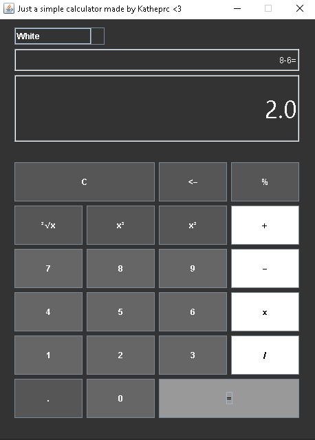

## TO DO:
- [x] ~~GUI~~  Sep 10 2023 
- [x] ~~Functionality of number and operations buttons to show them on main view~~      Sep 10 2023 
- [x] ~~Functionality of equal button to show results on main view~~ Sep 11 2023 
- [x] ~~Functionality of history view~~ Sep 11 2023
- [x] ~~Color themes dropdown~~ Sep 11 2023
- [ ] Compile into an executable

-----------------------------------------------------------------

## Screenshots:
  
  
  
  
  

